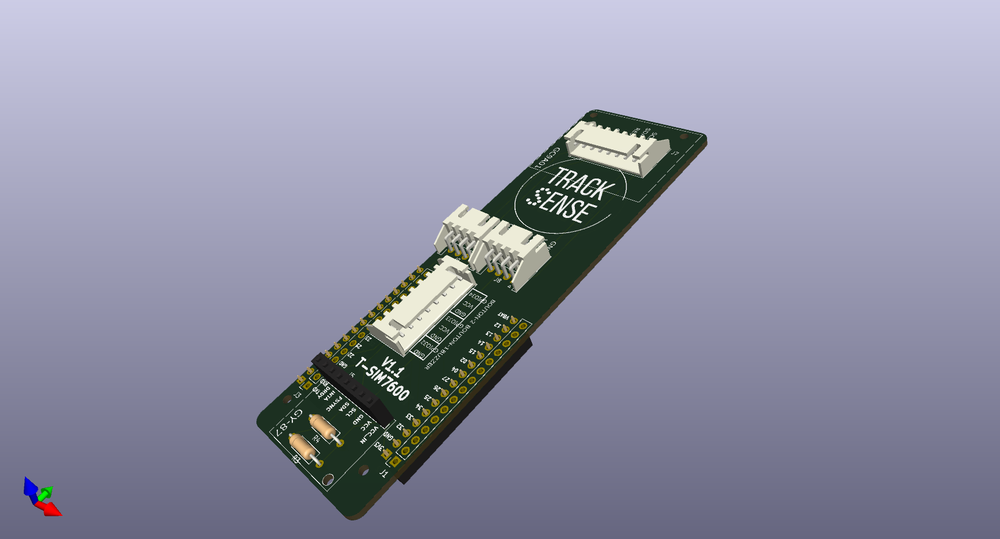
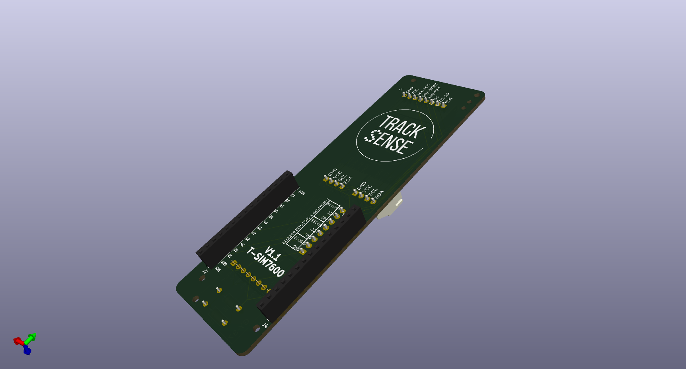

# Tracksense PCB V1.1
## Design
Cette nouvelle plaquette est compatible avec le LilyGo T-SIM7600x. Tous les fichiers produits avec [KiCad V8.0.0](https://gitlab.com/kicad) sont placés sous le répertoire KiCad. Il est possible de faire fabriquer cette plaquette chez de multiples fournisseurs. Pour simplifier le processus de fabrication de la plaquette, le répertoire [*Kicad/TrackSense-T-SIM7600x/Production*](\KiCad\TrackSense_T-SIM7600x\production) contient une archive ZIP qui peut être directement téléversé sur le site de [JLCPCB](https://jlcpcb.com). Cette archive a été construite à l'aide de l'extension KiCad [Fabrication Toolkit](https://github.com/bennymeg/Fabrication-Toolkit) qui permet de produire les fichiers Gerber ainsi qu'une nomenclature (*bill of materials*). Il est donc ainsi possible de faire assembler la plaquette et d'y faire installer le connecteurs par le fabricant. (*Toutes les composantes peuvent être facilement soudées à la main pour réduire les coûts*)

### Vue du dessus

### Vue du dessous

